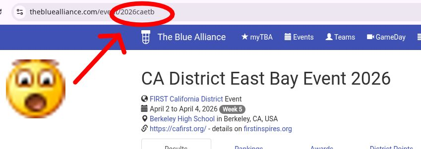

# bluescout
Script to help with scouting FRC events using tbapy

bluescout generates a .txt or .html file (depending on what version you use) with a list of matches that your team is in at an event

### Dependencies
python (tested with versions 3.11 and 3.14)

[Download Python](https://www.python.org/downloads/)

tbapy ([repo](https://github.com/frc1418/tbapy))
```
pip install tbapy
```

### Generating files
1. Create a TBA API key at [https://www.thebluealliance.com/account]

2. Download [bluescout-txt.py](./bluescout-txt.py) or [bluescout-html.py](./bluescout-html.py)

3. Run bluescout-txt.py or bluescout-html.py - It's recommended to run the script in a specific directory because it generates a new file for every event.

When you run the script, it'll ask you for the API key that you generated in step 1. It'll also ask for the specific event ID, which can be found in the URL for the event on TBA:



Once the file is generated it'll tell you where the file is located on your device, but that'll pretty much just be whatever directory you ran the script in.

### Todo
- Give the option to save the API key/event ID/team name to a file so that it doesn't have to be re-entered every time the script is run (to allow for periodically re-running the script in the background to refresh the file)
- Fix labeling for playoff matches - all playoff matches are labeled as just "Match 1". Not a huge priority because by playoffs you aren't really doing a lot of scouting lol
